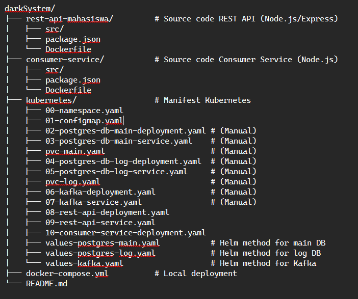

# Kafkube Experimental

This project implements a REST API system for student data integrated with Apache Kafka for asynchronous event processing. All services run in Docker containers and are orchestrated using Kubernetes.

## Tech Stacks

The system consists of several main components:
1.  **User**: Accesses the API.
2.  **REST API Mahasiswa** (Node.js/Express):  Handles requests, stores data in the main DB, and publishes events to Kafka.
3.  **Database Utama** (PostgreSQL): Stores master student data.
4.  **Apache Kafka**: Acts as a message broker for events.
5.  **Consumer Service** (Node.js): Consumes events from Kafka and stores them in the log DB.
6.  **Database Log** (PostgreSQL): Stores event logs for auditing and analytics.
7.  **Docker**: Packages each service into containers.
8.  **Kubernetes**: Orchestrates, scales, and deploys containers.

---
## Requirements

Ensure the following software is installed:
* **Docker & Docker Compose**: For local development and building *image*.
* **Minikube**  (or another Kubernetes cluster like Kind, Docker Desktop K8s, GKE, EKS, AKS).
* **`kubectl`**: Kubernetes CLI, configured to connect to your cluster.
* **Helm (v3+)**: If using the Helm *deployment* method.
* **Node.js & npm**: For local development or modifying services.
* **Git**: To clone the repository (if hosted on GitHub or similar).

---
## Project Structure

---
## Local Development with Docker Compose

To run the entire stack locally for development/testing:
1.  Ensure Docker Engine and Docker Compose are running.
2.  From the root directory (`darkSystem/`), execute
    ```bash
    docker-compose up --build
    ```
3.  Once all services are up: 
    * REST API will be available at `http://localhost:3000`.
    * Database main (PostgreSQL): `localhost:5432`
    * Database log (PostgreSQL): `localhost:5433`
    * Kafka (advertised listener for host): `localhost:29092`

---
## Kubernetes Deployment

There are two deployment methods:
1.  **Manual**: using Kubernetes YAML manifests.
2.  **Helm Method**: for deploying PostgreSQL and Kafka (recommended), with manual YAML for app services.

**Pre-deployment Steps (Both Methods):**
1.  **Build & Push Docker Images:**
    Replace <YOUR_DOCKER_REGISTRY_USERNAME> with your Docker Hub username or private registry path. But before that, you shall login into Docker Hub and configure "docker login" first for further development. Skip this step if you already had one or just use my image.
    ```bash
    # For REST API
    cd rest-api-mahasiswa/
    docker build -t <YOUR_DOCKER_REGISTRY_USERNAME>/rest-api-mahasiswa:latest .	
    docker push <YOUR_DOCKER_REGISTRY_USERNAME>/rest-api-mahasiswa:latest
    cd ..

    # For Consumer Service
    cd consumer-service/
    docker build -t <YOUR_DOCKER_REGISTRY_USERNAME>/consumer-service:latest .
    docker push <YOUR_DOCKER_REGISTRY_USERNAME>/consumer-service:latest
    cd ..
    ```
    *Alternatively (for Minikube only), you can use eval $(minikube -p minikube docker-env).*

2.  **Ensure ``kubectl`` is connected to your Minikube cluster:**
    ```bash
    minikube start
    kubectl config use-context minikube
    kubectl get nodes
    ```

### Method 1: Manual Deployment with YAML Files

This method is now using files that located in `kubernetes/` for every components. Ergo, make sure you are on that directory.

1.  **Create Namespace:**
    ```bash
    kubectl apply -f kubernetes/00-namespace.yaml
    ```
    All the resources will be deployed to the namespace `mahasiswa-app`.

2.  **Create Persistent Volume Claims (PVCs):**
    ```bash
    kubectl apply -f kubernetes/pvc-main.yaml -n mahasiswa-app
    kubectl apply -f kubernetes/pvc-log.yaml -n mahasiswa-app
    ```
    Wait until the PVC status become `Bound` also, run: `kubectl get pvc -n mahasiswa-app`

3.  **Create ConfigMap:**
    ```bash
    kubectl apply -f kubernetes/01-configmap.yaml -n mahasiswa-app
    ```

4.  **Deploy Main PostgreSQL DB:**
    ```bash
    kubectl apply -f kubernetes/02-postgres-db-main-deployment.yaml -n mahasiswa-app
    kubectl apply -f kubernetes/03-postgres-db-main-service.yaml -n mahasiswa-app
    ```

5.  **Deploy Log PostgreSQL DB:**
    ```bash
    kubectl apply -f kubernetes/04-postgres-db-log-deployment.yaml -n mahasiswa-app
    kubectl apply -f kubernetes/05-postgres-db-log-service.yaml -n mahasiswa-app
    ```

6.  **Deploy Kafka (Simple configuration, not production-ready):**
    ```bash
    kubectl apply -f kubernetes/06-kafka-deployment.yaml -n mahasiswa-app
    kubectl apply -f kubernetes/07-kafka-service.yaml -n mahasiswa-app
    ```
    Wait for all the Pods database and Kafka until `Running` and `READY` before keeping up to later step. Run this command also: `kubectl get pods -n mahasiswa-app -w`

7.  **Deploy REST API Mahasiswa:**
    Update the image field in 08-rest-api-deployment.yaml before applying. Skip if you wanted it otherwise (since I already build and push the images in my Docker repository).
    ```bash
    kubectl apply -f kubernetes/08-rest-api-deployment.yaml -n mahasiswa-app
    kubectl apply -f kubernetes/09-rest-api-service.yaml -n mahasiswa-app
    ```

8.  **Deploy Consumer Service:**
    Update the image field in `10-consumer-service-deployment.yaml`. Skip if you wanted it otherwise (since I already build and push the images in my Docker repository).
    ```bash
    kubectl apply -f kubernetes/10-consumer-service-deployment.yaml -n mahasiswa-app
    ```

### Method 2: Deployment Using Helm + YAML

This method is now using the Helm Chart for PostgreSQL dan Kafka, would be more robust and efficient.

1.  **Install Helm CLI** (if not already. You can also move into darkSystem/ directory and find get-helm.sh, then chmod' it already).

2.  **Create Namespace:** (if not to be created):
    ```bash
    kubectl apply -f kubernetes/00-namespace.yaml
    # or just leave it and let Helm cook flag --create-namespace
    ```

3.  **Add Helm Bitnami Repository:**
    ```bash
    helm repo add bitnami [https://charts.bitnami.com/bitnami](https://charts.bitnami.com/bitnami)
    helm repo update
    ```

4.  **Deploy Database Utama with Helm:**
    You can employ this `kubernetes/values-postgres-main.yaml` to customize (adjust your own *password*, *username*, *database name*, *storage size*).
    ```bash
    helm install postgres-main bitnami/postgresql \
      -f kubernetes/values-postgres-main.yaml \
      --namespace mahasiswa-app --create-namespace
    ```

5.  **Deploy Database Log with Helm:**
    By using this `kubernetes/values-postgres-log.yaml`.
    ```bash
    helm install postgres-log bitnami/postgresql \
      -f kubernetes/values-postgres-log.yaml \
      --namespace mahasiswa-app
    ```

6.  **Deploy Kafka with Helm:**
    Use this `kubernetes/values-kafka.yaml`.
    ```bash
    helm install kafka bitnami/kafka \
      -f kubernetes/values-kafka.yaml \
      --namespace mahasiswa-app
    ```
    Until all the Pods from Helm (PostgreSQL, Zookeeper, Kafka) are `Running` and `READY`.

7.  **Update ConfigMap:**
    * Check the PostgreSQL service: `kubectl get svc -n mahasiswa-app -l app.kubernetes.io/instance=postgres-main` (usually `<release-name>-postgresql`, for example `postgres-main-postgresql`).
    * Check the Kafka service: `kubectl get svc -n mahasiswa-app -l app.kubernetes.io/instance=kafka` (usually `<release-name>-headless` or `<release-name>`, for example `kafka-headless`).
    Edit this file `kubernetes/01-configmap.yaml` to adjust the `DATABASE_URL`, `LOG_DATABASE_URL`, the `KAFKA_BROKERS` with *service* name from Helm properly.
    And, apply ConfigMap:

    ```bash
     kubectl apply -f kubernetes/01b-configmap-helm.yaml -n mahasiswa-app
    ```

8.  **Deploy REST API dan Consumer Service (menggunakan YAML manual):**
    Make sure you change the repository like before or leave it default with my repository.
    ```bash
    kubectl apply -f kubernetes/08b-rest-api-deployment-helm.yaml -n mahasiswa-app
    kubectl apply -f kubernetes/09b-rest-api-service-helm.yaml -n mahasiswa-app
    kubectl apply -f kubernetes/10b-consumer-service-deployment-helm.yaml -n mahasiswa-app
    ```
    If the Pod API or Consumer is already running from a previous deployment and you only update the ConfigMap, you may need to restart the Pod so that it picks up the new configuration.
    ```bash
    kubectl rollout restart deployment rest-api-mahasiswa-helm -n mahasiswa-app # Adjust the name 08b
    kubectl rollout restart deployment consumer-service-helm -n mahasiswa-app    # Adjust the name to 09b
    ```
---
## Accessing the Application

After *deployment* is done, You can freely access the REST API.
* If the REST API Service uses `type: LoadBalancer`  (with supported cluster):
    ```bash
    kubectl get svc rest-api-mahasiswa-service -n mahasiswa-app
    ```
    Use the EXTERNAL-IP that was just displayed.
* Minikube with LoadBalancer/NodePort:
    ```bash
    minikube service rest-api-mahasiswa-service -n mahasiswa-app --url
    ```
* Using Port Forwarding:
    ```bash
    kubectl port-forward svc/rest-api-mahasiswa-service -n mahasiswa-app 8080:80
    ```
    ## Access at http://localhost:8080

---
## Testing Scenarios

The following is a summary of the test scenarios. Make sure all services are running in Kubernetes.

### 1. Event Publish Test
* **Goals**: Ensure events are published to Kafka.
* **Steps**:
    1.  Listen to Kafka topic mahasiswa_events:
        ```bash
        kubectl run kafkacat-listener -n mahasiswa-app --image=edenhill/kcat:1.7.1 --restart=Never --rm -it -- \
        kcat -b kafka-headless.mahasiswa-app.svc.cluster.local:9092 -t mahasiswa_events -C -J -q
        ```
    2.  Submit a POST request to the /api/mahasiswa endpoint of your REST API with the new student information.
* **Results**: Record the API request and response. Verify that the JSON message appears in kafkacat-listener (check eventType, data, and timestamp_api_sent).

### 2. Consumer Test
* **Goals**: Ensure the consumer processes events and logs them correctly.
* **Steps**:
    1.  Send a POST request to the API as described above.
    2.  Wait a few moments.
    3.  Port-forward to the log database service (e.g., postgres-log-postgresql if using Helm, or postgres-db-log-service if set up manually):
        ```bash
        # Adjust the service name and local port if needed
        kubectl port-forward svc/<nama-service-db-log> -n mahasiswa-app 5433:5432
        ```
    4.  Use a database tool (e.g., DBeaver, pgAdmin) to connect to localhost:5433 and check the event_logs table.
    5.  Check the consumer pod logs: `kubectl logs -l <label-selector-consumer> -n mahasiswa-app -f`.
* **Results**: A screenshot of the new data in event_logs. Verify event_type, payload, and all timestamps.

### 3. Integration Test
* **Goals**: Verify all components are connected and functioning end-to-end.
* **Steps**:
    1.  Ensure all pods (rest-api, consumer-service, Kafka, DBs) are in Running state: `kubectl get pods -n mahasiswa-app`.
    2.  Check the ConfigMap: (`kubectl get cm app-config -n mahasiswa-app -o yaml`) and environment variables in API/Consumer pods:(`kubectl exec <pod> -n mahasiswa-app -- printenv`).
    3.  Perform the full end-to-end flow: `POST` data -> Check Main DB (via port-forward) -> (Optional) Check Kafka -> Check DB Log.
* **Results**: Screenshot of pod and service statuses. Document successful data flow.

### 4. Horizontal Scaling Test (Consumer Service)
* **Goals**: Ensure no duplicate processing occurs when scaling the consumer.
* **Steps**:
    1.  Initially, ensure the consumer-service deployment is set to replicas: 1.
    2.  Send several messages. Verify no duplicates in event_logs.
    3.  Scale: `kubectl scale deployment consumer-service -n mahasiswa-app --replicas=2` (or 3).
    4.  Wait for the new pods to reach Running state..
    5.  Send additional messages.
* **Results**: Screenshot of: `kubectl get pods -n mahasiswa-app -l <label-selector-consumer>`. Check logs from all consumer pods. **CAUTION**: Verify that no duplicate entries exist in event_logs.

### 5. Latency Test
* **Goals**: Measure end-to-end delay.
* **Steps**:
    1.  Send 10–20 POST requests to the API.
    2.  Retrieve data from the event_logs table, focusing on: (timestamp_api_sent, timestamp_kafka_received, timestamp_processed).
    3.  Calculate:
        * $L_{end-to-end} = \text{timestamp_processed} - \text{timestamp_api_sent}$
        * $L_{consumer\_processing} = \text{timestamp_processed} - \text{timestamp_kafka_received}$
        * $L_{kafka\_queue} = \text{timestamp_kafka_received} - \text{timestamp_api_sent}$
* **Results**: Table of timestamps and latency values. Compute statistics: average, min, max, P95, and P99.

---
## Cleanup

Deleting all deployed resources.

```bash
# Method Manual
# Delete YAML in /kubernetes directory (in a namespace)
kubectl delete -f kubernetes/10-consumer-service-deployment.yaml -n mahasiswa-app
kubectl delete -f kubernetes/09-rest-api-service.yaml -n mahasiswa-app
kubectl delete -f kubernetes/08-rest-api-deployment.yaml -n mahasiswa-app
kubectl delete -f kubernetes/07-kafka-service.yaml -n mahasiswa-app
kubectl delete -f kubernetes/06-kafka-deployment.yaml -n mahasiswa-app
kubectl delete -f kubernetes/05-postgres-db-log-service.yaml -n mahasiswa-app
kubectl delete -f kubernetes/04-postgres-db-log-deployment.yaml -n mahasiswa-app
kubectl delete -f kubernetes/03-postgres-db-main-service.yaml -n mahasiswa-app
kubectl delete -f kubernetes/02-postgres-db-main-deployment.yaml -n mahasiswa-app
kubectl delete -f kubernetes/01-configmap.yaml -n mahasiswa-app
kubectl delete -f kubernetes/pvc-log.yaml -n mahasiswa-app
kubectl delete -f kubernetes/pvc-main.yaml -n mahasiswa-app
# Lastly, delete this shit
kubectl delete -f kubernetes/00-namespace.yaml

# Method Helm
# Delete Helm
helm uninstall postgres-main -n mahasiswa-app
helm uninstall postgres-log -n mahasiswa-app
helm uninstall kafka -n mahasiswa-app

# Delete application resources that were deployed manually.
kubectl delete -f kubernetes/10b-consumer-service-deployment-helm.yaml -n mahasiswa-app
kubectl delete -f kubernetes/09b-rest-api-service-helm.yaml -n mahasiswa-app
kubectl delete -f kubernetes/08b-rest-api-deployment-helm.yaml -n mahasiswa-app
kubectl delete -f kubernetes/01b-configmap-helm.yaml -n mahasiswa-app

# Delete PVCs (Helm may not automatically delete PVCs depending on the chart configuration)
kubectl delete pvc postgres-main-postgresql-0 -n mahasiswa-app  # PVC name may vary, check with `kubectl get pvc -n mahasiswa-app`
kubectl delete pvc postgres-log-postgresql-0 -n mahasiswa-app
kubectl delete pvc data-kafka-0 -n mahasiswa-app # Also check the Kafka PVC name

# Lastly, delete this shit
kubectl delete -f kubernetes/00-namespace.yaml
