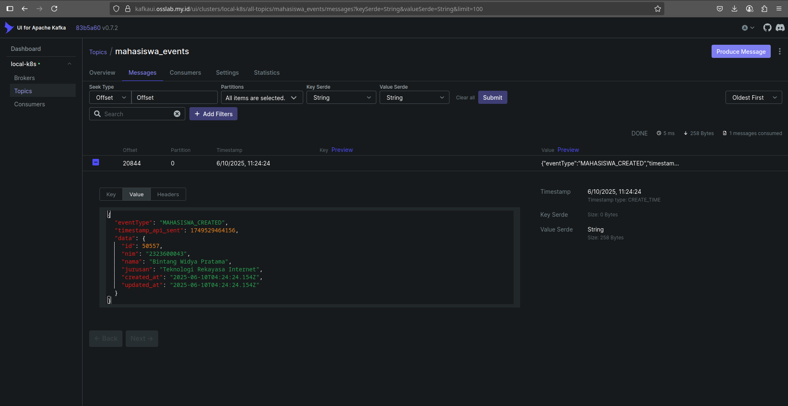
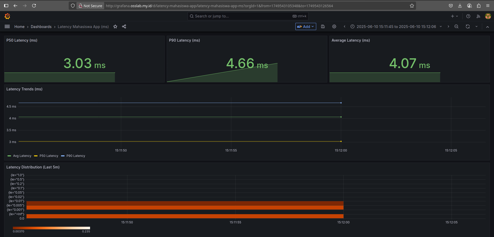

# Kafkube Experimental

This project implements a REST API system for student data integrated with Apache Kafka for asynchronous event processing. All services run in Docker containers and are orchestrated using Kubernetes.

## Tech Stacks

The system consists of several main components:
1.  **User**: Accesses the API.
2.  **REST API Mahasiswa** (Node.js/Express):  Handles requests, stores data in the main DB, and publishes events to Kafka.
3.  **Database Utama** (PostgreSQL): Stores master student data.
4.  **Apache Kafka**: Acts as a message broker for events.
5.  **Consumer Service** (Node.js): Consumes events from Kafka and stores them in the log DB.
6.  **Database Log** (PostgreSQL): Stores event logs for auditing and analytics.
7.  **Docker**: Packages each service into containers.
8.  **Kubernetes**: Orchestrates, scales, and deploys containers.

---
## Requirements

Ensure the following software is installed:
* **Docker & Docker Compose**: For local development and building *image*.
* **Minikube/k3s**  (or another Kubernetes cluster like Kind, Docker Desktop K8s, GKE, EKS, AKS).
* **`kubeadm`**: To configure your own cluster.
* **`kubectl`**: Kubernetes CLI, configured to connect to your cluster.
* **Node.js & npm**: For local development or modifying services.
* **Git**: To clone the repository (if hosted on GitHub or similar).

---
## Project Schema(s)
**Via Kubernetes**


**Via Docker-Compose**


---
## Local Development with Docker Compose

To run the entire stack locally for development/testing:
1.  Ensure Docker Engine and Docker Compose are running.
2.  From the root directory (`/`), execute
    ```bash
    docker-compose up --build
    ```
---
## Kubernetes Deployment

**Pre-deployment Steps (Both Methods):**
1.  **Build & Push Docker Images:**
    Replace <YOUR_DOCKER_REGISTRY_USERNAME> with your Docker Hub username or private registry path. But before that, you shall login into Docker Hub and configure "docker login" first for further development. Skip this step if you already had one or just use my image.
    ```bash
    # For REST API
    cd api-service/
    docker build -t <YOUR_DOCKER_REGISTRY_USERNAME>/rest-api-mahasiswa:latest .	
    docker push <YOUR_DOCKER_REGISTRY_USERNAME>/rest-api-mahasiswa:latest
    cd ..

    # For Consumer Service
    cd consumer-service/
    docker build -t <YOUR_DOCKER_REGISTRY_USERNAME>/consumer-service:latest .
    docker push <YOUR_DOCKER_REGISTRY_USERNAME>/consumer-service:latest
    cd ..

    # For Frontend
    cd mahasiswa-app-frontend/
    docker build -t <YOUR_DOCKER_REGISTRY_USERNAME>/frontend-last:latest .
    docker push <YOUR_DOCKER_REGISTRY_USERNAME>/frontend-last:latest
    cd ..

    # For Dashboard  Frontend (Landingpage)
    cd dashboard-frontend/
    docker build -t <YOUR_DOCKER_REGISTRY_USERNAME>/dashboard-frontend:latest .
    docker push <YOUR_DOCKER_REGISTRY_USERNAME>/dashboard-frontend:latest
    cd ..
    ```
    *Alternatively (for Minikube only), you can use eval $(minikube -p minikube docker-env).*

2.  **Ensure ``kubectl`` is connected to your Minikube cluster:**
    ```bash
    minikube start
    kubectl config use-context minikube
    kubectl get nodes
    ```
    **Or ensure your k3s is recognizing your kubectl.**
    
---
### Deployment with Script (deploy-all.sh)

This method is now using files that located in `/kubernetes/` for every components. Ergo, make sure you are on `/scripts/` and execute `./deploy-all.sh`.

---
## Testing Scenarios

The following is a temporary summary of the test scenarios. Make sure all services are running in Kubernetes.

### 1. Event Publish Test
* **Goals**: Ensure events are published to Kafka.
* **Steps**:
    1.  After KafkaUI integration, first of all, add data mahasiswa that already linked to `http://sister.osslab.my.id/`.
    
    2. Finally you can check inside the KafkaUI that already linked to ``https://kafkaui.osslab.my.id/`` and check the Topics section.
    
    3.  (Optional) Submit a POST request (via 3rd party e.g. Postman or Insomnia) to /api/mahasiswa endpoint of your REST API with the new student information, the link is the same `http:/ sister.osslab.my.id/`.
* **Results**: Record the API request and response. Verify that the JSON message appears in the KafkaUI panel.

### 2. Consumer Test
* **Goals**: Ensure the consumer processes events and logs them correctly.
* **Steps**:
    1.  Add a data mahasiswa first or send a POST request to the API as described above.
    2.  Wait a few moments.
    3.  Use a database tool (e.g., DBeaver, pgAdmin) to connect to this URL `https://postgre.osslab.my.id/` (user: pgadmin4@test.com | password: admin123)
    
    4.  Don't forget to check the consumer pod logs: `kubectl logs -l <label-selector-consumer> -n mahasiswa-app -f`.
    
    
* **Results**: A screenshot of the new data in event_logs. Verify event_type, payload, and all timestamps.

### 3. Integration Test
* **Goals**: Verify all components are connected and functioning end-to-end.
* **Steps**:
    1.  Ensure all pods (rest-api, consumer-service, Kafka, DBs) are in Running state: `kubectl get pods -n mahasiswa-app`.
    
    2.  Check the ConfigMap: (`kubectl get cm app-config -n mahasiswa-app -o yaml`)
    
    or check:(`kubectl get svc -n mahasiswa-app`) and ('kubectl get nodes')
    
    3.  Alternatively, you can check that in the dashboard page.
    
* **Results**: Screenshot of pod and service statuses. Document successful data flow.

### 4. Horizontal Scaling Test (Consumer Service)
* **Goals**: Ensure no duplicate processing occurs when scaling the consumer.
* **Steps**:
    1.  Scale: `kubectl scale deployment consumer-service -n mahasiswa-app --replicas=2`
    2.  Wait for the new pods to reach Running state..
    3.  Send additional messages check `/tests/` folder to execute `./test-load.sh`.
    
* **Results**: Screenshot of: `kubectl get pods -l app=consumer-service -n mahasiswa-app -o wide` and `kubectl get deployment consumer-service -n mahasiswa-app -o wide`.

Check logs from all consumer pods, for example in the KafkaUI dashboard:
## KafkaUI

Or check the DB Main and DB Log:
## DB-Log:

## DB-Main:
**CAUTION**: Verify that no duplicate entries exist in event_logs.

### 5. Latency Test
* **Goals**: Measure end-to-end delay.
* **Steps**:
    1.  Send some POST requests to the API or just use `./test-load.sh`.
    2.  Retrieve data from the event_logs table, focusing on: (timestamp_api_sent, timestamp_kafka_received, timestamp_processed) that Consumer-Service provided for measure the metrics.
    3.  If you prepare for manual calculate you can go straigt into DB Log:
        * $L_{end-to-end} = \text{timestamp_processed} - \text{timestamp_api_sent}$
        * $L_{consumer\_processing} = \text{timestamp_processed} - \text{timestamp_kafka_received}$
        * $L_{kafka\_queue} = \text{timestamp_kafka_received} - \text{timestamp_api_sent}$
    4. If you don't, then go straight to Grafana and Prometheus:
    Grafana:
    
    Prometheus:
    
    5. Alternatively, you can do it manually via script that located in `/tests` and execute `/.latency-test.sh`. 
* **Results**: Table of timestamps and latency values. Compute statistics: average, min, max, P95, and P99.

---
## Cleanup

Deleting all deployed resources, you can just go straight to `/scripts/` and just execute `./delete-all.sh`


